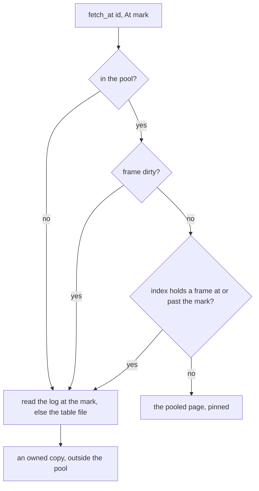

# Milestone 10, transactions — Design

Sources: `docs/projectplan.md` M10, the Concurrency section and decision D2 of `docs/design.md`,
`docs/internals.md` section 4, [FR44]-[FR55], and `docs/testplan.md` harness [H2] with suites
[S6] and [S7], the six anomalies of section 4.2, and [T5]-[T7]. Built on the log of milestone 9
and the executor of milestone 8.

## Overview

- `BEGIN`, `COMMIT` and `ROLLBACK` for real: all of a transaction's changes or none of them, and
  a result that matches some serial order of the transactions that ran.
- One write lock for each database puts writers in a serial order; a reader takes no lock and
  reads the log at a mark of its own, so it never waits and never sees a change that came after
  it started.

## Components

- `WriteLock`, `WriteGuard`: one lock for each database, held from `BEGIN` to commit or rollback.
  A wait past `lock_timeout_ms` fails with `LOCK_TIMEOUT`. `crates/server/src/txn/lock.rs`.
- `Transaction`, `TxnKind`: what a connection holds between `BEGIN` and its end, and the three
  refusals it answers. `src/txn/manager.rs`.
- `Readers`, `Lease`: the live snapshot marks of a database, so a checkpoint never truncates a
  frame a reader still needs. `src/txn/manager.rs`.
- `Database` gains `lock: WriteLock` and `readers: Readers`, beside the `Wal` it got in
  milestone 9. `src/catalog/mod.rs`.
- `Session` gains the open transaction and reports its state in every `Ready`.
  `src/net/session.rs`.
- `Wal` gains `commit_end`, `committed()` and `truncate_to(mark)`. `FrameIndex` gains
  `newer_than` and `drop_from`. `src/wal/`.
- `BufferPool` gains `fetch_at(id, Mark)` and `discard(wal)`; `BTree` carries the `Mark` its
  reads use. `src/store/`.
- `[H2]`: a runner that drives many connections through a scripted interleaving, and the
  serializability check of [T6]. `crates/server/tests/h2/mod.rs`.

## Data Model

Nothing changes on disk. The log file, the frames and the catalog keep the shape milestone 9
gave them.

- `Transaction`: `kind: TxnKind`, `snapshot: u64` (the mark a read-only transaction reads at),
  `start: u64` (the log end at `BEGIN`, which a rollback cuts back to), `guard: Option<WriteGuard>`,
  `lease: Option<Lease>`, `aborted: bool`.
- `TxnKind`: `ReadOnly`, `ReadWrite`.
- `Mark`: `Latest` for a writer, which sees its own uncommitted pages, or `At(u64)` for a reader.
- `Readers`: a count for each live mark, so `oldest()` is the smallest of them.
- Two error codes join `protocol`: `READ_ONLY_TXN` and `TXN_ALREADY_OPEN`.

## Interfaces

- `WriteLock::acquire(timeout) -> Result<(), DbError>`, `release()`. `LOCK_TIMEOUT` on a wait
  that runs out.
- `Database::begin(kind) -> Result<Transaction, DbError>`: `ReadWrite` takes the lock,
  `ReadOnly` takes a lease at `wal.committed()`.
- `Transaction::commit(pool, db)`, `Transaction::rollback(pool, db)`,
  `Transaction::check_writable()` -> `READ_ONLY_TXN`, `Transaction::mark() -> Mark`.
- `Wal::committed() -> u64`: the offset just past the last commit frame, which is what a reader
  takes as its mark.
- `Wal::truncate_to(mark)`: cuts the file back, drops every index entry at or past the mark.
- `FrameIndex::newer_than(table, page_no, mark) -> bool`: has this page changed since the mark.
- `BufferPool::fetch_at(id, Mark) -> Result<PageRef, DbError>`: a pooled page when the pool's
  copy is good for that mark, an owned copy read from the log or the table file when it is not.
- `BufferPool::discard(wal)`: drops every page of that log's files from the pool, which is what
  a rollback leaves behind.
- `BTree::open(pool, file, table, mark)`: every read of the tree goes through that mark.

## Flow

A statement, in `Session::run_statement`:

- 1. `BEGIN`: a transaction already open answers `TXN_ALREADY_OPEN`. Otherwise `ReadWrite` takes
  the write lock, waiting up to `lock_timeout_ms`, and `ReadOnly` records `wal.committed()` and
  takes a lease.
- 2. `COMMIT` or `ROLLBACK` with nothing open answers `SYNTAX_ERROR` saying no transaction is
  open. Otherwise `COMMIT` appends every dirty page of the database to the log, then a commit
  frame, then one `fsync`, and the lock falls.
- 3. `ROLLBACK` with a transaction open: the pool drops the database's pages, the log cuts back
  to `start`, the lock falls. Nothing uncommitted ever reached a `.tbl` file, so there is nothing
  to undo.
- 4. A change inside a `ReadOnly` transaction answers `READ_ONLY_TXN`. A `CREATE` or `DROP` of a
  database or a table with any transaction open answers `SCHEMA_CHANGE_IN_TXN`.
- 5. A change with no transaction open is its own transaction: take the lock, run, commit,
  release.
- 6. A read uses `Latest` inside a read-write transaction, `At(snapshot)` inside a read-only one,
  and `At(wal.committed())` with a lease when no transaction is open. The lease travels with the
  `Answer`, so it falls when the last row has gone out.
- 7. Every reply is followed by `Ready` carrying `Open`, `ReadOnly` or `None`.

A page read at `At(mark)`:

A disconnect with a transaction open rolls it back, which is what `[FR65]` asked for and
milestone 2 left as a stub.

## Key Decisions

- D1. A snapshot read goes around the pool when the pool's copy is too new. Alternative: a copy
  of each changed page for each transaction, which is MVCC in the pool. Why: every write goes
  through the pool, so the pool's copy of a page is always the newest one; a reader only has to
  ask the index whether that page changed since its mark, and read around when it did. One pool
  for the whole server is what `[NFR10]` wants.
- D2. The mark is the offset past the last commit frame, not `wal.end()`. Alternative: `end`,
  which milestone 9 used. Why: an eviction appends an uncommitted page frame and raises `end`, so
  a reader at `end` can read a page no one committed.
- D3. A statement with no transaction open is its own transaction. Alternative: refuse a change
  outside `BEGIN`. Why: the case files of [S1] to [S5] and the CLI send single statements, and
  `[FR44]` asks for a transaction, not for the only way to write.
- D4. `WriteLock` is a `Mutex<bool>` and a `Condvar`, and `WriteGuard` holds an `Arc<Database>`.
  Alternative: hold a `std::sync::MutexGuard`. Why: a guard cannot be stored across statements
  without a lifetime on everything that holds it, and the standard mutex has no timed lock for
  `LOCK_TIMEOUT`.
- D5. The checkpoint stays at the end of a statement, and skips while a reader's mark is behind
  the log. Alternative: the background thread milestone 9 named. Why: `projectplan.md` does not
  put a thread in this milestone, and a checkpoint truncates the log, so it has to wait for the
  oldest reader either way. One client still waits through a 64 MB copy.
- D6. `READ_ONLY_TXN` and `TXN_ALREADY_OPEN` join the error codes. Alternative: reuse
  `TXN_ABORTED`. Why: `[FR54]` makes `TXN_ABORTED` the code that tells a client to try again, and
  a client that retries a write inside a read-only transaction never succeeds. A `COMMIT` or a
  `ROLLBACK` with nothing open answers `SYNTAX_ERROR`, because nothing was aborted and there is
  nothing to retry.
- D7. `[FR50]` is held statement by statement, and `COMMIT` re-checks nothing. Alternative:
  validate every changed row at commit. Why: each statement already checks the key, the nulls and
  the types before it writes anything, and there are no deferred constraints, so no broken row
  can exist at commit time.
- D8. A rollback drops the database's pages out of the pool. Alternative: keep them and let the
  log answer. Why: the pool's copy is the newest form of a page, so leaving an uncommitted one in
  it would serve that change to the next reader.
- D9. A rollback leaks the pages its transaction grew the file by. The free list in page 0 goes
  back, so the pages are unreachable, not corrupt. The upgrade is a free-list sweep at startup,
  which milestone 12 can afford.
- D10. `[FR52]` needs no code. A connection sees exactly one database, so a transaction cannot
  reach a second one.
- D11. `[H2]` is a Rust runner with `Send` and `Expect` steps, not another case-file format.
  Alternative: extend the `.test` files of `[H1]`. Why: an interleaving needs a client to send a
  statement and leave the reply unread while another client runs, and a file of statement and
  expected result cannot say that.
- D12. `[T6]` checks serializability by replaying the transactions in commit order: a read-write
  transaction's reads must match the state just before its own commit, and a read-only
  transaction's reads must match some prefix of that order. Alternative: a general checker that
  looks for a cycle in the dependency graph. Why: one writer at a time means the commit order is
  already the serial order, and the commit replies arrive in it.

## Risks

- A `Condvar` does not wake waiters in order, so a connection can lose the lock to a newer one
  several times over. `LOCK_TIMEOUT` bounds the damage at `lock_timeout_ms`. A fair queue is a
  later change if the load tests of milestone 12 show starvation.
- A long read-only transaction holds the log back: no checkpoint can run while its mark is
  behind, so the log grows to `wal_max_bytes` and writers then fail with `STORAGE_FULL`. The
  reader still finishes. `design.md` names the same rule ("it stops at the oldest live reader").
- A snapshot read of a page that changed since the mark costs a read of the log or the file every
  time, with no caching. A long scan under a busy writer pays that on every page.
- Writers hold the lock for a whole transaction, so a client that opens a transaction and goes
  quiet blocks every other writer until it disconnects. There is no idle timeout in
  `requirements.md`.
