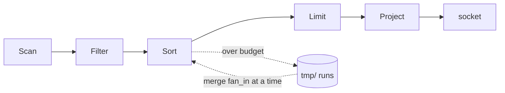

# Milestone 11, query completeness — Design

Sources: `docs/projectplan.md` M11, the query execution section and the memory budget of
`docs/design.md`, `docs/internals.md` sections 3 and 5, [FR37]-[FR40] and [FR66] with
[NFR11]-[NFR13], and `docs/testplan.md` suite [S5]. Built on the executor of milestone 8 and the
snapshot reads of milestone 10.

## Overview

- `ORDER BY` on any column, at any size, inside the memory limit, and a statement a client can
  stop while it runs.
- A sort on the primary key is the order the B-tree already holds, forwards or backwards. Any
  other sort fills a budget of rows in memory, writes it to `tmp/` as a sorted run, and merges
  the runs.

## Components

- `Sort`: an operator that hands back its input in order. `crates/server/src/exec/sort.rs`.
- `ExternalSort`: fills a budget, sorts it, spills a run, then merges the runs until one is left.
  `src/store/extsort.rs`.
- `RunFile`: one sorted run on disk, read back through a small buffer. `src/store/extsort.rs`.
- `Cursor` gains a direction, so a descending scan walks the leaves by their `prev` links.
  `src/store/btree.rs`.
- `planner::plan` puts `Sort` between the condition and the count, and leaves it out when the
  tree already holds the order. `src/exec/planner.rs`.
- `Registry::sweep` clears `<database>/tmp/` at startup. `src/catalog/registry.rs`.
- `CancelHandle` reaches the operators, and clears between statements. `src/net/cancel.rs`,
  `src/net/session.rs`.

## Data Model

A run file, in `<data_dir>/<database>/tmp/<connection>-<run>.run`:

- One record after another: a `u32` length, then the row as `store::codec` encodes it against the
  input schema. No page structure, because nothing seeks into a run: it is written once and read
  once, forwards.
- A row too large for a page is no trouble here, so a sort of 1 MB values needs no chain.

`ExternalSort`: `budget: u64`, `fan_in: usize`, `held: Vec<Row>`, `bytes: u64`,
`runs: Vec<RunFile>`, `dir: PathBuf`, `key: usize`, `descending: bool`.

`RunFile`: `path: PathBuf`, `reader: BufReader<File>`, `head: Option<Row>`. Its `Drop` removes
the file, so a sort that ends early leaves nothing behind.

## Interfaces

- `Sort::new(input, key, descending, dir, limits) -> Result<Sort, DbError>`: the operator.
- `ExternalSort::add(row) -> Result<(), DbError>`: holds the row, and spills a run when the
  budget is full.
- `ExternalSort::finish() -> Result<Merge, DbError>`: merges down to one source and hands back
  something that yields rows in order.
- `RunFile::write(dir, rows, key, descending) -> Result<RunFile, DbError>`,
  `RunFile::head() -> Option<&Row>`, `RunFile::advance() -> Result<(), DbError>`.
- `Cursor` takes a `Direction`, and `BTree::cursor(from, to, direction)`.
- `CancelHandle::clear()`: the session calls it before each statement.
- `Limits` gains `sort: u64`, the bytes one sort holds in memory. Default 10 MB, from
  `--sort-bytes`.

## Flow

A `SELECT` with an `ORDER BY`:

- 1. The planner resolves the column. A column the table has not got answers `UNKNOWN_COLUMN`.
- 2. The column is the primary key: the scan carries the direction and no `Sort` is built.
- 3. Any other column: `Scan`, then `Filter`, then `Sort`, then `Limit`, then `Project`. `Sort`
  sits under `Limit`, because a limit counts the rows of the order, and over `Project`, because
  `ORDER BY` may name a column the selection leaves out.
- 4. The first `next()` of `Sort` drains its input: each row joins the held rows, and when they
  pass the budget they are sorted and written to `tmp/` as a run.
- 5. Nothing spilled: the held rows are sorted in memory and handed out one at a time.
- 6. Something spilled: the last held rows become a run too, then the runs merge
  `fan_in` at a time into longer runs, until one is left. Each pass reads every run through a
  64 KB buffer and writes one.
- 7. Rows come out of the last run, one for each `next()`.

A cancel:

- 1. A second connection sends `Cancel`, which sets the flag of the first.
- 2. `Scan` and `Sort` read the flag between rows, and inside the fill and the merge, which are
  the long loops. A set flag ends the statement with `CANCELLED`.
- 3. The run files go with the `Sort`, because `RunFile::drop` removes them.
- 4. The connection stays open. The session clears the flag before the next statement.
- 5. A cancelled change inside a transaction ends that transaction, which is milestone 10's rule
  for any statement that failed partway.

## Key Decisions

- D1. A descending sort on the primary key walks the leaves backwards. Alternative: send it
  through the external sort. Why: the leaves are doubly linked already, so the order is there for
  the taking, and the alternative writes a whole table to `tmp/` to produce an order the tree
  holds.
- D2. `CANCELLED` joins the error codes. Alternative: reuse `TXN_ABORTED`. Why: that code tells a
  client to try again, and retrying what the user just stopped is the opposite of what was asked.
- D3. The budget counts encoded bytes, not the heap a `Vec<Row>` takes. Alternative: measure the
  allocation. Why: the encoded length is what reaches the run file and it is exact, while the
  heap size of a `Vec<Value>` is a guess at best.
- D4. `ExternalSort::new` takes the fan-in as well as the budget. Alternative: a constant 160.
  Why: a test that proves a multi-pass merge needs more runs than the fan-in, and with 160 that
  means thousands of rows and the disk to hold them.
- D5. The budget is a setting, with 10 MB the default. Alternative: a constant. Why: a test
  cannot otherwise reach a spill without writing 10 MB, which is the whole budget a build is
  allowed.
- D6. A null sorts after every value ascending, and before them descending. Alternative: nulls
  first. Why: `Value::compare` has no answer for a null, so the order is this design's to pick,
  and a null is the absence of a value rather than the smallest one.
- D7. `Sort` writes every row of its input before it hands back the first, even under a `LIMIT`.
  Alternative: hold only the first N rows in a heap. Why: the top-N sort is an optimisation that
  `requirements.md` does not ask for, and the ceiling is one pass over rows that are already on
  disk.
- D8. The cancel flag reaches the operators as a parameter of the plan. Alternative: a context
  object that carries the transaction and the flag together. Why: only the read path reads it,
  and one parameter is smaller than a type.
- D9. The 100 GB of the done-when is milestone 12's, as every figure in section 3.1 of
  `requirements.md` has been since milestone 6. This milestone proves the shape with a budget
  small enough to spill on a few hundred rows.

## Risks

- A merge pass reads and writes every row, so a sort of a table that is `n` times the budget
  costs `log(n)` passes over the whole table. 100 GB at a 10 MB budget is 10000 runs, which is
  two passes at a fan-in of 160. The cost is the disk, not the memory.
- `tmp/` has to hold the whole result while a sort runs, and nothing checks the free space.
  A sort larger than the disk fails partway with a storage error and removes its runs.
- A cancel is read between rows, so a statement blocked inside one long read does not stop until
  that read returns. No operator blocks for longer than one page read.
- Clearing `tmp/` at startup assumes no other server is running on the same data directory.
  Nothing takes a lock on the directory, which is also true of the table files today.
