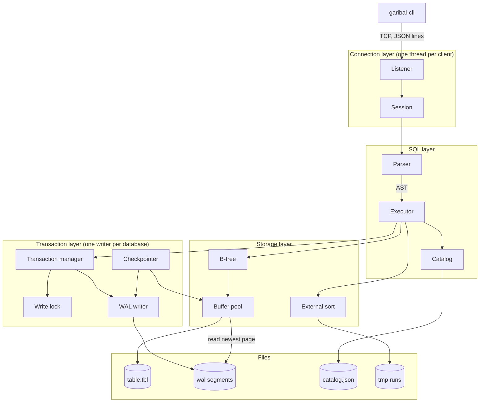

# GaribalDB — Design

Version 1. Date 2026-09-09.

## Overview

- A single-node SQL database server. Clients connect over TCP and send JSON messages.
- Tables are B-trees in paged files. A redo-only WAL gives durability. One writer for each
  database gives serializability, and readers see a snapshot, so they never wait.

## Components



**Connection layer**

- `net`: `TcpListener`. Accepts a connection and starts one `std::thread` for it. Blocking I/O.
- `session`: the state that one thread owns. Connection id, cancel secret, database name,
  open transaction, and the read snapshot mark. 256 KB.

**SQL layer**

- `parser`: hand-written lexer and recursive descent parser. Produces an AST.
- `executor`: iterator operators. `SeqScan`, `PkScan`, `Filter`, `Project`, `Sort`, `Limit`.
- `catalog`: reads and writes `catalog.json`. Held in memory.

**Transaction layer**

- `txn`: runs `BEGIN`, `COMMIT`, and `ROLLBACK`. At `BEGIN` it takes the write lock for a
  read-write transaction, or records the WAL mark for a read-only one. At `COMMIT` it appends
  the commit frame, calls `fsync`, then releases the lock. At `ROLLBACK` it truncates the WAL
  back to the start of the transaction. It refuses a write from a read-only transaction, a
  second transaction on one connection, and DDL while a transaction is open.
- `lock`: one write lock for each database. Held from `BEGIN` to commit or rollback.
- `wal`: appends frames, calls `fsync`, keeps the page-to-frame index.
- `checkpointer`: a background thread. Copies committed pages into the `.tbl` files,
  then truncates the WAL.

**Storage layer**

- `btree`: B-tree keyed by the primary key. Slotted pages. Overflow chains.
- `pool`: fixed buffer pool. Clock eviction, pin and unpin.
- `sort`: external merge sort, used for `ORDER BY` on a column that is not the primary key.
  Pass 1 fills 10 MB, sorts it in memory, and writes a sorted run to `tmp/`.
  Pass 2 merges 160 runs at a time, and repeats until one run is left.

## On-Disk Layout

```
<data_dir>/
  <db_name>/
    catalog.json      schema. Rewritten whole, temp file then rename.
    <table_id>.tbl    one file for each table. 8 KB pages.
    wal/*.wal         WAL segments for this database.
    tmp/              external sort runs. Cleared at startup.
```

- A database is a directory. `CREATE DATABASE` makes one. There is no server-level catalog.
- A table file is named by id, not by name, so a rename touches only the catalog.
- At startup the server deletes each `.tbl` file that the catalog does not name.

## Page and Record Format

- Page size 8 KB, fixed at build time. Page 0 of a file holds the B-tree root pointer and the free list head.
- Page header: page LSN u64, page type u8, slot count u16, free space offset u16.
- Slotted page. Slots grow from the front, records from the back.
- Record: null bitmap, then each value. `INTEGER` 8 bytes. `BOOLEAN` 1 byte.
  `DECIMAL` a sign byte, a scale byte, and a 16-byte integer. `TEXT` a length and UTF-8 bytes.
- A value over 2 KB moves to an overflow chain. The record keeps a 12-byte pointer.
- `DECIMAL(p, s)` holds `p` up to 38, so a 128-bit integer with a scale is exact. No float.

## Concurrency

- One write lock for each database. A read-write transaction takes it at `BEGIN` and holds it to
  commit or rollback. Writers never overlap.
- A read-only transaction takes no lock. It records the WAL frame count at `BEGIN` and reads only
  frames below that mark, so it sees a fixed snapshot.
- Serializable follows: writers are already in a serial order, and a reader behaves as if it ran
  at its snapshot point.
- `BEGIN READ ONLY` versus `BEGIN` declares the intent, so a lock upgrade never happens and
  the server needs no deadlock detection.
- A lock wait longer than the configured timeout fails with `LOCK_TIMEOUT`.

## Durability and Recovery

- Redo-only WAL, the method that SQLite WAL mode uses. There is no undo log and no ARIES.
- A changed page appends to the WAL. The `.tbl` file never holds an uncommitted page.
- A reader looks in the WAL index first, then in the `.tbl` file.
- `COMMIT` appends a commit frame, calls `fsync`, then releases the write lock.
- Each frame holds a CRC32. Recovery stops at the first bad CRC.
- Recovery: read the WAL forward, find the last commit frame, ignore every frame after it.
  Nothing else is needed.
- A checkpoint copies committed pages into the `.tbl` files, `fsync`s them, then truncates the WAL.
  It starts when the WAL passes 64 MB. It stops at the oldest live reader.
- The WAL has a maximum size. The default is 8 GB. A write that passes it fails with `STORAGE_FULL`.
- A failed `fsync` is fatal. The server refuses further commits and stops.

## Query Execution

- Iterator model. Each operator returns one row from `next()`.
- A row goes to the socket as soon as it is ready. Nothing collects the full result.
- `WHERE` on the primary key uses `PkScan`. Every other `WHERE` is a `SeqScan`, because
  `CREATE INDEX` is out of scope.
- `ORDER BY` on the primary key is free. The B-tree already holds that order.
- Any other `ORDER BY` uses an external merge sort. It writes 10 MB runs to `tmp/`, then merges
  160 runs in each pass with a 64 KB buffer for each run.

## Protocol

- TCP. One JSON object for each message, ended by a newline.
- `Startup` carries a protocol version and a database name. The server refuses a version it does not know.
- Statement flow: `Query` → `RowDesc` → `DataRow` (repeated) → `Complete` → `Ready`.
- `Ready` carries the transaction state, which gives the CLI its prompt.
- `Error` carries a code, a message, and a position in the statement.
- `DECIMAL` travels as a JSON **string**. A JSON number is a float and would lose digits.
- A value carries its type as a tag, because `Text` and `Decimal` are both JSON strings:

```
{"type":"datarow","values":[{"Integer":1},{"Text":"x"},{"Decimal":"12.20"},"Null"]}
```
- Cancel: the client opens a second connection and sends `Cancel` with the connection id and the
  secret from `Ready`. TCP back pressure controls row flow, so there is no cursor.

## Memory Budget

Total 1 GB, the default that `[NFR10]` sets.

| Part | Size | Note |
|---|---|---|
| Buffer pool | 640 MB | 78000 pages |
| Query workspace | 256 MB | Lent to at most 25 sorts at 10 MB |
| WAL index | 16 MB | 8 GB WAL ÷ 8 KB × 12 bytes |
| Catalogs | 8 MB | |
| Sessions | 25 MB | 100 × 256 KB |
| Total | 945 MB | |

`[NFR13]` sets a 10 MB ceiling for one connection, not a reservation. A connection holds 256 KB
and borrows workspace only while it sorts. This keeps `[NFR13]` and `[NFR10]` both true.

## Key Decisions

- D1. Redo-only WAL. Alternative: ARIES with undo and CLRs. Why: uncommitted pages live in the WAL
  file, not in memory, so NO-STEAL holds with a fixed memory budget and undo is never needed.
- D2. One write lock for each database, snapshot reads. Alternative: one lock for the whole server,
  or full MVCC. Why: `[FR52]` forbids a transaction across databases, so a per-database lock is
  correct, and snapshot reads stop a long scan from blocking every writer.
- D3. Paged B-tree on disk. Alternative: all rows in memory with a WAL. Why: `[NFR1]` needs 100 GB
  and `[NFR10]` caps memory at 1 GB.
- D4. 8 KB pages. Alternative: 4 KB. Why: a full scan reads half as many pages, and the B-tree depth
  is 4 levels at either size, so 4 KB buys nothing back.
- D5. Line-delimited JSON. Alternative: a binary protocol, or the PostgreSQL wire protocol.
  Why: `nc` drives the server on day one, and swapping the encoder later does not change the
  message set. Cost: `[NFR17]` is harder to reach.
- D6. Thread for each connection. Alternative: `tokio`. Why: `[NFR14]` asks for 100 connections,
  and disk reads block the thread anyway.
- D7. Hand-written parser. Alternative: `sqlparser-rs`. Why: section 4 of `requirements.md` holds
  11 statements, so the parser is about 800 lines.
- D8. `catalog.json` rewritten whole. Alternative: a system table in the WAL. Why: `[FR55]` keeps
  DDL out of transactions, so an atomic rename gives crash safety with no WAL record.
- D9. No secondary indexes. Alternative: a second B-tree. Why: `CREATE INDEX` is out of scope in
  `requirements.md`.

## Crates

| Crate | Where | Purpose |
|---|---|---|
| `serde`, `serde_json` | server, CLI | Protocol messages and `catalog.json` |
| `crc32fast` | server | WAL frame checksums |
| `log` | server | Log macros. No transitive crates. The backend is written here. |
| `rustyline` | CLI | Line editing, history, multi-line input |

Everything else is `std`.

The source is a Cargo workspace of three crates: `protocol`, `server`, and `cli`.
`internals.md` holds the layout and the types.

## Known Limits

- A `WHERE` on a column that is not the primary key reads the whole table. At 1 billion rows and
  `[NFR17]`, that is about 17 minutes.
- A long read transaction holds back the checkpoint, so the WAL grows for as long as it runs.
- One large transaction writes its whole change set to the WAL before it commits. The disk must
  hold the data plus the largest write set, up to the 8 GB WAL limit.
- `ORDER BY` on a column that is not the primary key sorts on disk. A 100 GB sort moves about
  500 GB of I/O.
