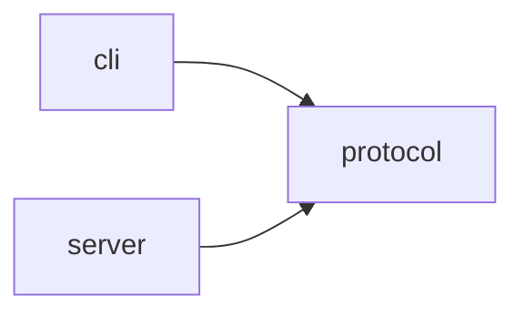
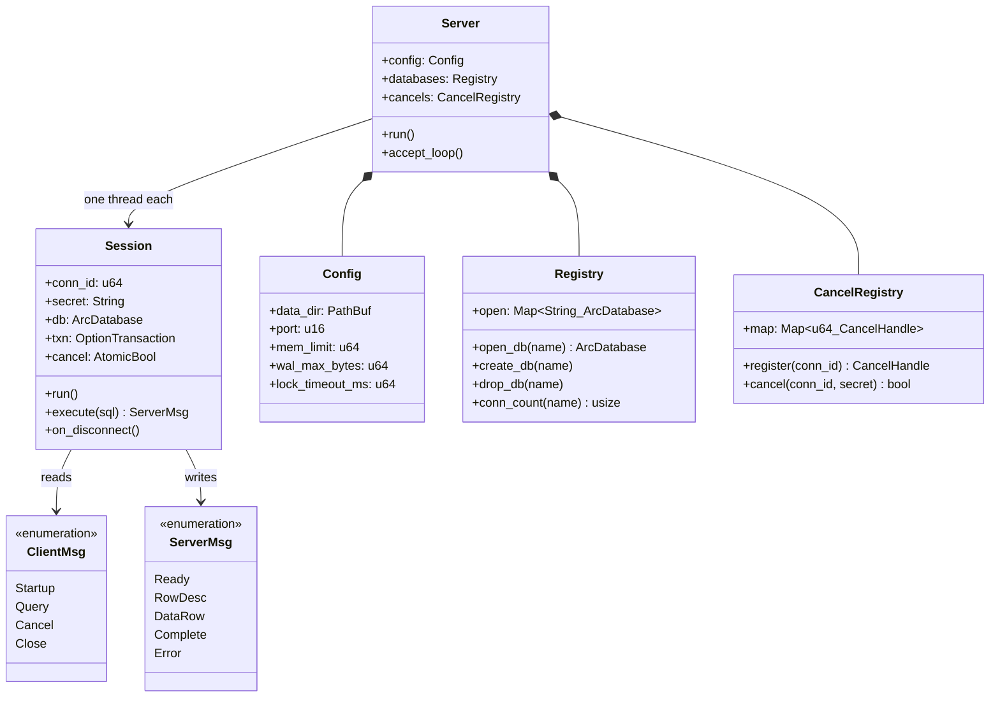
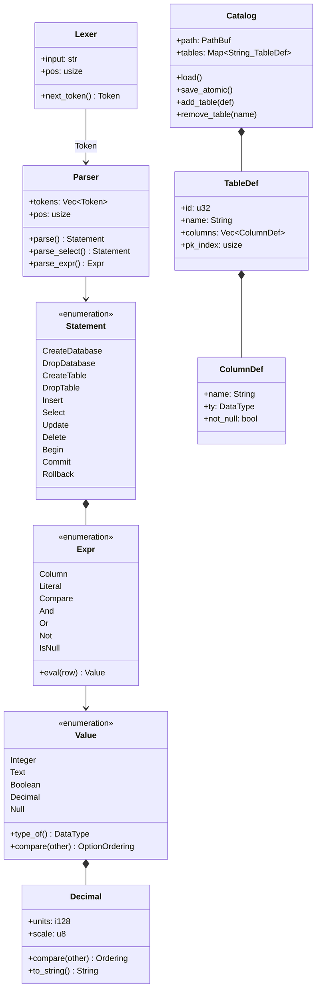
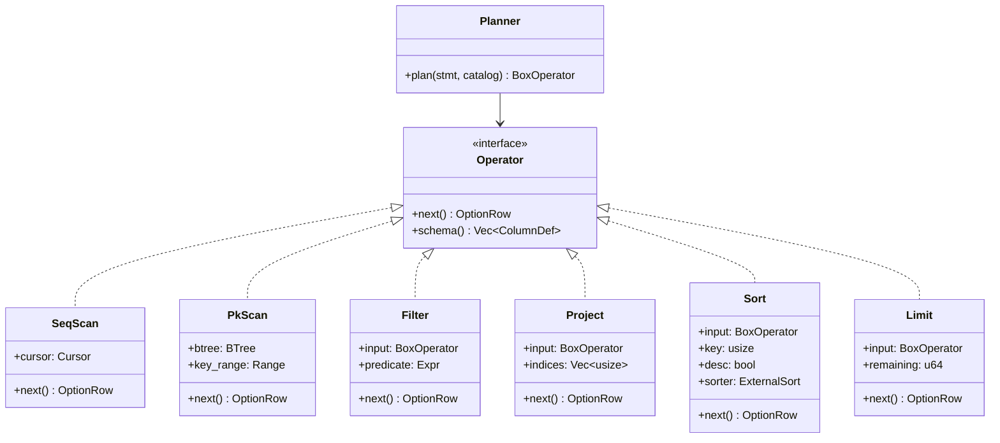
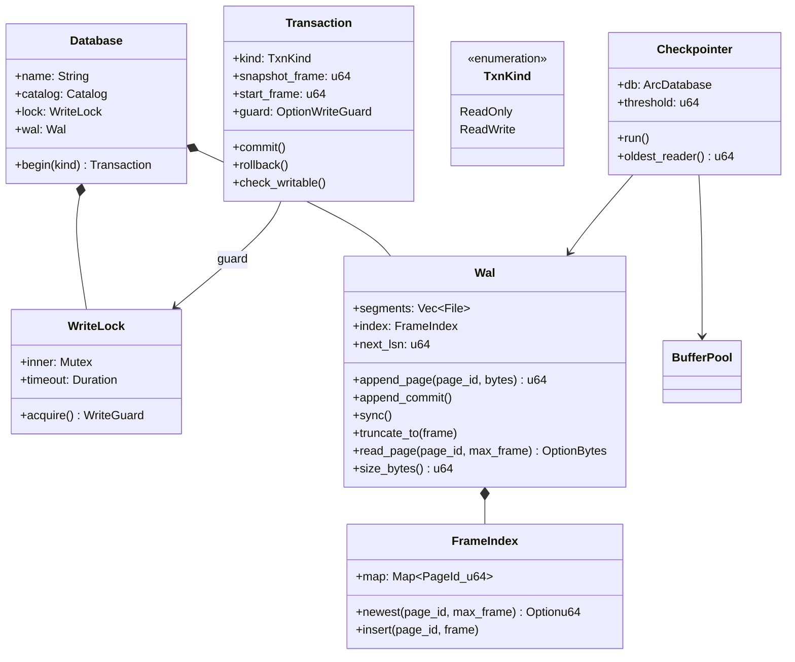
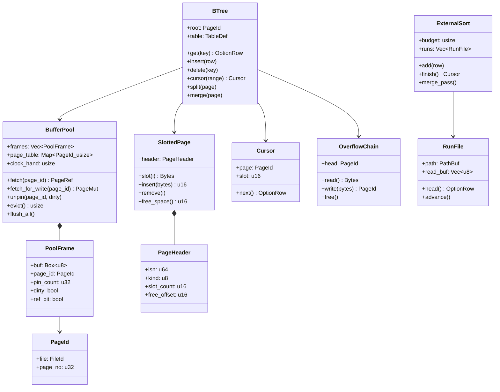
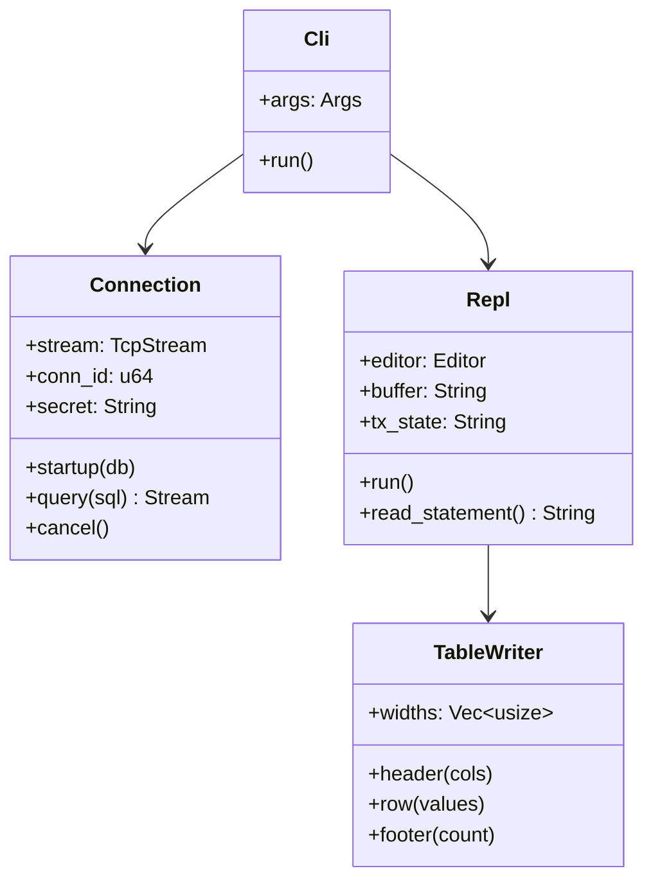
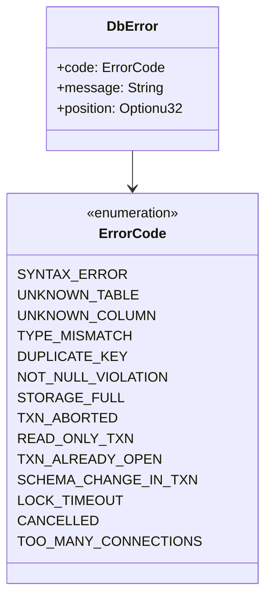

# GaribalDB — Internals

Version 1. Date 2026-09-09.

Types for each layer in `design.md`. Rust, so a "class" is a struct, an enum, or a trait.
Field types are shortened for the diagrams. `Vec~T~` reads as `Vec<T>`.

## Workspace Layout

```
Cargo.toml               workspace members
crates/
  protocol/              shared contract, no engine code
    src/
      lib.rs
      message.rs         ClientMsg, ServerMsg
      value.rs           Value, DataType, Decimal
      error.rs           ErrorCode, DbError
  server/                binary: garibaldb-server
    src/
      main.rs
      config.rs
      net/
        listener.rs      Server
        session.rs       Session
        cancel.rs        CancelRegistry
      sql/
        token.rs         Token
        lexer.rs         Lexer
        parser.rs        Parser
        ast.rs           Statement, Expr
      catalog/
        mod.rs           Catalog, TableDef, ColumnDef
      exec/
        planner.rs       plan()
        operator.rs      Operator trait
        scan.rs          SeqScan, PkScan
        filter.rs        Filter, Project, Limit
        sort.rs          Sort
      txn/
        manager.rs       Transaction, TxnKind
        lock.rs          WriteLock, WriteGuard
      wal/
        writer.rs        Wal, Frame
        index.rs         FrameIndex
        checkpoint.rs    Checkpointer
      store/
        pool.rs          BufferPool, PoolFrame
        page.rs          SlottedPage, PageHeader, PageId
        btree.rs         BTree, Cursor
        overflow.rs      OverflowChain
        codec.rs         encode_row, decode_row
        extsort.rs       ExternalSort, RunFile
  cli/                   binary: garibaldb
    src/
      main.rs            Cli
      conn.rs            Connection
      repl.rs            Repl
      render.rs          TableWriter
```

Dependencies go one way only.



`protocol` holds the message types, `Value`, `DataType`, `Decimal`, and `ErrorCode`. It has no
engine code and no `std::fs`. `cli` cannot reach a `BTree`, because it does not depend on `server`.

## 1. Connection Layer



- `Session::run` is the thread body. Read a message, run it, write the reply, repeat.
- `Session::on_disconnect` rolls back an open transaction. This gives `[FR63]`.
- `Registry::conn_count` lets `DROP DATABASE` refuse while a client is connected. This gives `[FR4]`.
- `cancel` is an `AtomicBool`. Operators check it between rows.

## 2. SQL Layer



- `Value`, `DataType`, and `Decimal` live in the `protocol` crate, not in `server`. Both programs
  need them, and the CLI must render a `Decimal` without losing digits.
- `Value::compare` returns an option. A comparison with `Null` returns none, which gives `[FR36]`.
- `Decimal` holds a 128-bit integer and a scale, so 38 digits stay exact. This gives `[FR19]`.
- `Catalog::save_atomic` writes a temp file, `fsync`s it, renames it, then `fsync`s the directory.

## 3. Execution



- Every operator holds its input as `Box<dyn Operator>`. The chain pulls one row at a time.
- `Planner` picks `PkScan` when the `WHERE` names the primary key. Everything else gets `SeqScan`.
- `Sort` is the only operator that holds more than one row.

## 4. Transaction Layer



- `begin(ReadWrite)` takes the lock. `begin(ReadOnly)` records `snapshot_frame` and takes nothing.
- `read_page(page_id, max_frame)` is what makes a snapshot work. A reader passes its own
  `snapshot_frame`, so it never sees a newer write.
- `rollback` calls `truncate_to(start_frame)`. Nothing reached the `.tbl` file, so there is no undo.
- `Checkpointer::oldest_reader` stops a checkpoint from passing a live snapshot.

## 5. Storage Layer



- One buffer pool for the whole server, and not one for each database. `[NFR10]` caps the
  memory of the server, and 100 databases with a pool each cannot hold inside it.
- A `FileId` is handed out when the pool first opens a `.tbl`, and never reaches the disk. So a
  `PageId` is unique across every database without any database needing a number of its own,
  which would need the server-level catalog that `design.md` rules out.
- `fetch` returns a pinned page. The caller must `unpin`. A pinned page is never evicted.
- `evict` uses the clock method. It sweeps frames, clears a set `ref_bit`, and takes the first
  frame with a clear bit and no pins.
- A page read goes to `Wal::read_page` first, then to the `.tbl` file. This is the snapshot rule.
- `OverflowChain` holds a value over 2 KB. The record in the page keeps a 12-byte pointer.

## 6. CLI



- `Repl::read_statement` collects lines until a `;`. `rustyline` gives history and editing.
- `Connection::cancel` opens a second socket and sends `Cancel` with the id and the secret.
- `TableWriter` prints rows as they arrive, so it measures widths from the first rows only.

## Errors



Every fallible function returns `Result<T, DbError>`. The session turns a `DbError` into an
`Error` message and keeps the connection open.
