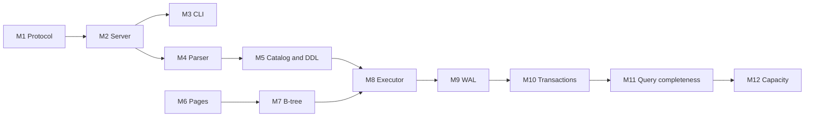

# GaribalDB — Project Plan

Version 1. Date 2026-09-09.

Twelve milestones. Each one is a unit of work that you turn into its own spec later.
Each one ends with something you can run and show.

Sources: `requirements.md`, `design.md`, `internals.md`, `testplan.md`.

## Order

M6 does not wait for anything. Start it beside M4 if you want two fronts.

## Phases

| Phase | Milestones | End state |
|---|---|---|
| A. Talk | M1, M2, M3 | A client connects and gets an answer. No SQL yet. |
| B. Understand | M4, M5 | The server parses SQL and keeps a schema. No rows yet. |
| C. Store | M6, M7, M8 | Rows go to disk and come back. Not yet safe. |
| D. Guarantee | M9, M10 | ACID holds. Crash tests pass. |
| E. Complete | M11, M12 | Every requirement met at full size. |

---

## M1. Protocol

**Goal.** The shared contract between the server and the CLI.

**Scope**
- `crates/protocol`, a library with no file I/O and no engine code.
- `message.rs`: `ClientMsg` and `ServerMsg` as serde enums, tagged by a `type` field.
- `value.rs`: `Value`, `DataType`, `Decimal`. `Decimal` holds `i128` units and a `u8` scale.
- `Decimal` serializes as a JSON **string**, never as a number.
- `error.rs`: `ErrorCode` with the ten codes, and `DbError`.
- `Value::compare` returns `Option<Ordering>`. `Null` gives `None`.

**Requirements.** [FR14]-[FR21], [FR67]-[FR69]

**Done when.** A round-trip test encodes and decodes each message. `Decimal` keeps 38 digits
through a JSON round trip.

**Depends on.** Nothing.

---

## M2. Server

**Goal.** A server that accepts connections and answers messages. It knows no SQL.

**Scope**
- `crates/server`, binary `garibald`.
- `config.rs`: data directory, port, memory limit, WAL limit, lock timeout.
- `net/listener.rs`: `Server`. `TcpListener`, one `std::thread` for each connection.
- `net/session.rs`: `Session`. Startup handshake, message loop, disconnect.
- `net/cancel.rs`: `CancelRegistry`. Second connection sends `Cancel` with an id and a secret.
- Every `Query` answers `Error(UNKNOWN_TABLE)` for now.
- Server log for a connection, an error, and startup.

**Requirements.** [FR61]-[FR66], [FR81]-[FR83], [NFR14], [NFR20], [NFR21]

**Done when.** `nc` connects, sends `Startup`, gets `Ready`, sends `Query`, gets `Error` and
`Ready`. 100 connections run at the same time. A `Cancel` on a second socket sets the flag.

**Depends on.** M1.

---

## M3. CLI

**Goal.** A usable client. From here you never need `nc` again.

**Scope**
- `crates/cli`, binary `garibaldb`.
- `conn.rs`: `Connection`. Startup, query, cancel on a second socket.
- `repl.rs`: `Repl`. `rustyline` for history and editing. Collect lines until a `;`.
- `render.rs`: `TableWriter`. Aligned columns, `NULL` shown, rows printed as they arrive.
- Prompt shows the transaction state from `Ready`.
- `-c "SQL"` runs one statement and stops with a status code.
- Ctrl-C stops the query and keeps the connection.

**Requirements.** [FR71]-[FR80]

**Done when.** `garibaldb -c "SELECT 1"` prints the server error and stops with a non-zero code.
Ctrl-C during a slow answer returns the prompt with the connection open.

**Depends on.** M2.

---

## M4. SQL front end

**Goal.** Turn SQL text into an AST, or into an error with a position.

**Scope**
- `sql/token.rs` and `sql/lexer.rs`: `Token`, `Lexer`.
- `sql/parser.rs`: hand-written recursive descent. All 11 statements in section 5 of
  `requirements.md`.
- `sql/ast.rs`: `Statement` and `Expr`.
- Expressions: `= != < <= > >=`, `AND`, `OR`, `NOT`, `IS NULL`, `IS NOT NULL`, parentheses.
- A parse failure returns `SYNTAX_ERROR` with the character position.
- `[H1]` statement runner from `testplan.md`. Test files hold statements and expected results.

**Requirements.** [FR31]-[FR35], [FR67], [FR70]

**Done when.** Every statement form in section 5 parses. `[H1]` runs a file of cases and reports
pass or fail.

**Depends on.** M2.

---

## M5. Catalog and DDL

**Goal.** Databases and tables exist and survive a restart. Still no rows.

**Scope**
- `catalog/mod.rs`: `Catalog`, `TableDef`, `ColumnDef`.
- `catalog.json` for each database. `save_atomic` writes a temp file, `fsync`, rename,
  `fsync` the directory.
- `Registry`: open a database, create one, drop one, count connections.
- `CREATE DATABASE`, `DROP DATABASE`, `CREATE TABLE`, `DROP TABLE`.
- `DROP DATABASE` refuses while a client is connected.
- `Startup` names a database. A client sees only that database.
- At startup, delete each `.tbl` file that the catalog does not name.

**Requirements.** [FR1]-[FR13]

**Done when.** Create a table, stop the server, start it, and `DROP TABLE` finds it. A crash
between file creation and the rename leaves no orphan file.

**Depends on.** M4.

---

## M6. Pages and buffer pool

**Goal.** Read and write 8 KB pages inside a fixed memory budget.

**Scope**
- `store/page.rs`: `PageId`, `PageHeader`, `SlottedPage`. Slots from the front, records from the back.
- `store/codec.rs`: `encode_row` and `decode_row`. Null bitmap, then values.
- `store/pool.rs`: `BufferPool`, `PoolFrame`. `fetch`, `fetch_for_write`, `unpin`, `flush_all`.
- Clock eviction. A pinned page is never evicted.
- `store/overflow.rs`: `OverflowChain` for a value over 2 KB.
- Page 0 of a file holds the root pointer and the free list head.

**Requirements.** [NFR6], [NFR7], [NFR10]-[NFR13]

**Done when.** Write 10 GB through a 64 MB pool and read it back correctly. Peak memory stays
inside the limit. A 1 MB value round-trips through an overflow chain.

**Depends on.** Nothing. Run it beside M4 and M5.

---

## M7. B-tree

**Goal.** An ordered map from primary key to row, on disk.

**Scope**
- `store/btree.rs`: `BTree`, `Cursor`.
- `get`, `insert`, `delete`, `cursor(range)`.
- Node split on insert. Node merge on delete.
- A cursor walks leaves in key order, for a full scan and for `ORDER BY` on the primary key.
- A duplicate key fails with `DUPLICATE_KEY`.

**Requirements.** [FR28], [NFR2]

**Done when.** Insert 10 million keys in random order, then read them back in key order.
Delete half, and the tree stays correct. A duplicate key fails.

**Depends on.** M6.

---

## M8. Executor

**Goal.** The first real database. SQL in, rows out, on disk. No transactions yet.

**Scope**
- `exec/operator.rs`: the `Operator` trait, `next()` returns one row.
- `exec/scan.rs`: `SeqScan`, `PkScan`. `exec/filter.rs`: `Filter`, `Project`, `Limit`.
- `exec/planner.rs`: pick `PkScan` when the `WHERE` names the primary key.
- `INSERT`, `SELECT`, `UPDATE`, `DELETE` wired to the B-tree.
- A change applies to every row that matches.
- Constraint checks: duplicate key, `NOT NULL`, wrong type.
- Rows stream to the socket. Nothing collects a full result.

**Requirements.** [FR22]-[FR30], [FR36], [FR40]-[FR43]

**Done when.** `[H1]` passes suites `[S1]` to `[S5]` and `[S10]`. A `SELECT` of 10 million rows
runs inside the memory limit.

**Depends on.** M5 and M7.

---

## M9. WAL and recovery

**Goal.** Data survives a power failure.

**Scope**
- `wal/writer.rs`: `Wal`. Append a page frame, append a commit frame, `sync`, `truncate_to`.
- CRC32 on each frame. Recovery stops at the first bad CRC.
- `wal/index.rs`: `FrameIndex`. Newest frame for a page, bounded by a mark.
- `read_page(page_id, max_frame)`: look in the WAL, then in the `.tbl` file.
- Recovery: read forward, find the last commit frame, ignore every frame after it.
- `wal/checkpoint.rs`: `Checkpointer`. Copy committed pages to `.tbl`, `fsync`, truncate the WAL.
  Start at 64 MB. Stop at the oldest live reader.
- A failed `fsync` is fatal. Refuse further commits.
- `[H3]` crash runner. `kill -9` and `dm-log-writes` for power loss.

**Requirements.** [FR56]-[FR60], [NFR18], [NFR19]

**Done when.** `[T10]` to `[T13]` pass. 100 power cuts at random moments lose no committed
transaction. A cut during recovery still recovers.

**Depends on.** M8.

---

## M10. Transactions

**Goal.** ACID. Serializable.

**Scope**
- `txn/lock.rs`: `WriteLock`, `WriteGuard`. One for each database. `LOCK_TIMEOUT` on a wait.
- `txn/manager.rs`: `Transaction`, `TxnKind`.
- `BEGIN` takes the lock. `BEGIN READ ONLY` records the WAL mark and takes no lock.
- `COMMIT` appends a commit frame, `fsync`, releases the lock.
- `ROLLBACK` truncates the WAL to the start mark.
- Refuse a write from a read-only transaction, a second transaction on one connection, and DDL
  while a transaction is open.
- A commit fails if a row breaks a rule of its table.
- `Ready` carries the transaction state.
- `[H2]` concurrency runner.

**Requirements.** [FR44]-[FR55]

**Done when.** Suites `[S6]` and `[S7]` pass. All six anomalies in section 4.2 of `testplan.md`
are absent. `[T6]` finds a serial order for 1000 random transactions from 20 clients.

**Depends on.** M9.

---

## M11. Query completeness

**Goal.** Every query requirement, at any size.

**Scope**
- `exec/sort.rs`: `Sort`. `ORDER BY` on the primary key uses the B-tree order.
- `store/extsort.rs`: `ExternalSort`, `RunFile`. 10 MB runs to `tmp/`, merge 160 at a time.
- `tmp/` cleared at startup.
- `LIMIT`.
- `TEXT` sorts by UTF-8 byte order. `DECIMAL` sorts by numeric value, so `12.20` equals `12.2`.
- Cancel reaches the operators. They check the flag between rows.

**Requirements.** [FR37]-[FR39], [FR64]

**Done when.** `ORDER BY` on 100 GB finishes inside the memory limit. Ctrl-C stops a sort and
frees the run files.

**Depends on.** M10.

---

## M12. Capacity and performance

**Goal.** Prove the numbers.

**Scope**
- Enforce each limit in section 3.1 of `requirements.md`. Return `STORAGE_FULL`.
- Reads keep working after a write is refused.
- WAL size limit, default 8 GB.
- Memory budget: 640 MB pool, 256 MB workspace, 16 MB WAL index, 8 MB catalogs, 25 MB sessions.
- Workspace is lent, not reserved. At most 25 sorts at 10 MB.
- `[H4]` load runner. `[H5]` data generator. `[H6]` resource monitor.
- Weekly suites `[S13]` to `[S16]`.

**Requirements.** [NFR1]-[NFR19]

**Done when.** `[T14]` to `[T17]` pass. 100 GB in one table. Memory at 100 GB matches memory at
1 GB. The release states each SHOULD requirement it does not meet.

**Depends on.** M11.

---

## Notes

- A milestone ends with a demo, not with a layer. M8 is the first one that looks like a database.
- M6 is the only milestone with no upstream. Start it early if you want a second front.
- `[H1]` arrives in M4, so M5 onward add test files instead of manual checks.
- Turn one milestone at a time into a spec. Do not write the spec for M9 before M8 runs.
